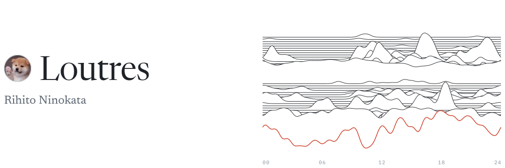
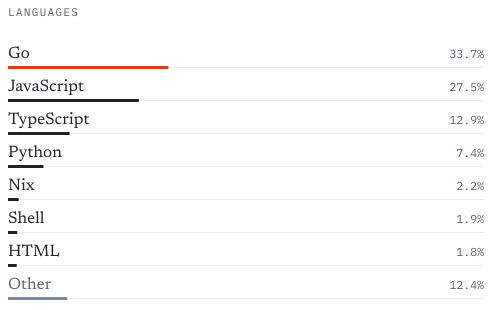
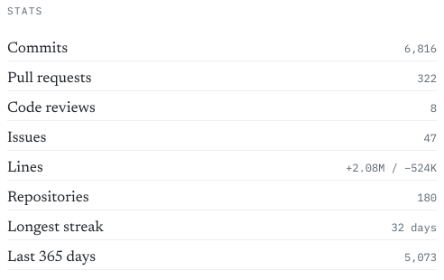

<picture>
  <source media="(prefers-color-scheme: dark)" srcset="./assets/stats/header-dark.svg">
  
</picture>

  <picture><source media="(prefers-color-scheme: dark)" srcset="./assets/stats/languages-dark.svg"></picture>
  <picture><source media="(prefers-color-scheme: dark)" srcset="./assets/stats/stats-dark.svg"></picture>

- **Interests**: Kubernetes, BGP, SRv6, security, agent harness
- **Languages**: Go
- **Infra**: Linux, Kubernetes, Cisco
- **Contributed to**: [kubevirt/kubevirt](https://github.com/kubevirt/kubevirt), [coredns/coredns](https://github.com/coredns/coredns), [projectcalico/calico](https://github.com/projectcalico/calico)

**Work**

- [juneau](https://github.com/1outres/juneau): a CNI for Kubernetes with VPCs and subnets for hard multi-tenancy
- [AS38656](https://bgp.tools/as/38656): my own network, peering at a few IXPs
- [mNi-Cloud](https://github.com/mNi-Cloud): a cloud platform on Kubernetes; I do most of the backend

[loutres.me](https://loutres.me) · [X](https://x.com/loutres_) · [Mail](mailto:me@loutres.me)
